# The Tornado Project

## Table of contents
- [About](#about)
  - [Screenshots](#screenshots)
- [History](#history)
  - [About the source code](#about-the-source-code)
  - [More Screenshots](#more-screenshots)
- [Community](#community)
- [Review and download](#review-and-download)
- [Compiling](#compiling)
- [New keyboard shortcuts](#new-keyboard-shortcuts)
  - [Miscellaneous](#miscellaneous)
  - [Split-screen](#split-screen)
  - [Night Vision Colours](#night-vision-colours)
  - [Tracking View](#tracking-view)
  - [Drone View](#drone-view)
  - [Other External Views](#other-external-views)
  - [Full-screen HUD and TV-Tab views](#full-screen-hud-and-tv-tab-views)
  - [ZRK-Romb (Gecko) and ZSU-23-4 (Shilka) views](#zrk-romb-gecko-and-zsu-23-4-shilka-views)
- [Command-line-parameters](#command-line-parameters)

## About
Tornado is a combat flight simulator computer game by Digital
Integration that models the Panavia Tornado. It was released in 1993 for
MS-DOS and Amiga. Tornado is regarded by many as one of the best DOS
flight simulators of the 1990s.

The complete simulator consists of a powerful Advanced Mission Planner,
which was ahead of its time. The Mission Planner was more advanced than
what the RAF had back in 1993. Many regard Tornado has having the best
flight simulator mission planner for many years. The simulator also has
a dynamic campaign system. Among its other strengths are fast
flat-shaded graphics that give a real sense of speed at low-level, five
autopilot modes, accurate avionics and flight mechanics, multiple
weapons modeling, thousands of objects in the 3D environment and
classic 332-paged paper manual.

### Screenshots
[](01.PNG?raw=true "01")
[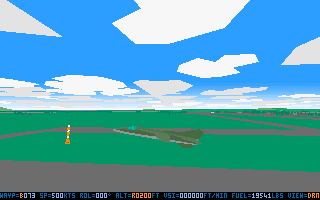](SCRSHOTS/02.PNG?raw=true "02")
[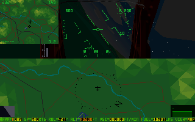](SCRSHOTS/03.PNG?raw=true "03")
[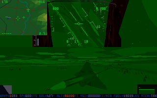](SCRSHOTS/04.PNG?raw=true "04")
[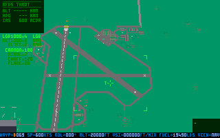](SCRSHOTS/05.PNG?raw=true "05")
[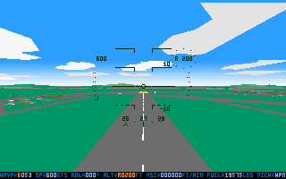](SCRSHOTS/06.PNG?raw=true "06")
[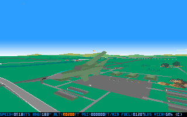](SCRSHOTS/07.PNG?raw=true "07")
[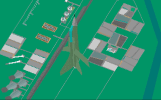](SCRSHOTS/08.PNG?raw=true "08")
[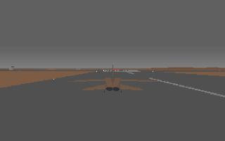](SCRSHOTS/09.PNG?raw=true "09")
[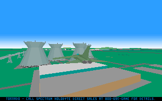](SCRSHOTS/10.PNG?raw=true "10")

## History
Digital Integration was acquired by Titus Interactive SA, previously
Titus France SA, in 1998. Titus filed for bankruptcy in 2005 and its
[game rights](https://en.wikipedia.org/wiki/Titus_Interactive#Games)
were transferred to Interplay Entertainment. Tornado was not in that
asset list of games, with patch development ended long ago in
October 1994. By that time, Digital Integration had already turned its
attention to its next generation of simulations, starting with Apache
Longbow (1994).

### About the source code
The source code in this repository is a heavily modded version of the 3D
simulation engine Tornado Version 1.0's FLIGHT.EXE. The unmodded version
of the Tornado Version 1.0 FLIGHT.EXE source code can be found [within
this
repository](https://github.com/TornadoGame/Tornado/tree/9bff7df0ca7345475f5d9c028b232c94ccbf99c7).
The source code was written in x86 assembly language for the PC
in 1993. The 3D simulation engine was written completely by Kevin
J. Bezant, lead programmer at Digital Integration. It compiles to
FLIGHT.EXE. The source code is not the complete game as it lacks the
front-end GUI menus, the Advanced Mission Planner (AMP) and the 1994
Desert Storm add-on.

In April 2016, the 16-bit assembly language source code to FLIGHT.EXE,
the 3D simulation engine of Tornado was discovered in a CD-ROM belonging
to one of the ex-developers. Frankie Kam sought, and was granted
permission by Interplay to form a development team to enhance the
original simulator. The source code to FLIGHT.EXE was then made
available, by Digital Integration's ex-developer, for redevelopment in
April 2016. The development team was to be sourced, formed and funded by
Frankie Kam. However, as of July 2017, due to a lack of funds and a
scarcity of 16-bit assembly language coders interested in a project on a
25-year old flight simulator, no coders were found.

In August 2017, Frankie Kam started to modify Tornado on his own, in
lieu of a proper development team. In November 2017, clarification was
again sought of Interplay as to the status of the project, with regards
to Interplay's involvement. Interplay replied that there was not much it
could do as the rights holder was unclear. So as of 2018, it is unclear
who owns the rights to Tornado. To date, the full source code, including
the Advanced Mission Planner, front-end GUI, 1994 Desert Storm add-on,
patch codes and image file decrypter, has never been found. Thus
rendering an enhancement of the full simulation impossible. Tornado is
neither being sold on GOG.com nor on Steam.

As of August 2018, over 95 enhancements have been made to FLIGHT.EXE. A
full list of changes can be found
[here](http://dogsofwarvu.com/forum/index.php/topic,5046.0.html). An
illustrated summary of the major mods created can be found
[here](http://dogsofwarvu.com/forum/index.php/topic,5064.msg30814.html#msg30814).

The FLIGHT.EXE program generated by this source code can be run from the
DOSBox command prompt. For best and full experience, you need to have,
buy or own the complete Digital Integration Tornado simulator package
for MS-DOS. The package includes the Advanced Mission Planner and full
set of missions and campaigns.

### More Screenshots
[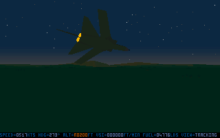](SCRSHOTS/11.PNG?raw=true "11")
[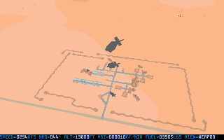](SCRSHOTS/12.PNG?raw=true "12")
[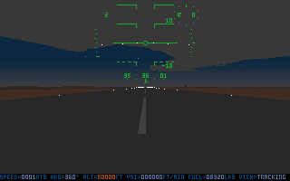](SCRSHOTS/13.PNG?raw=true "13")
[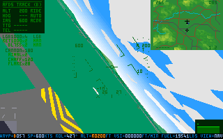](SCRSHOTS/14.PNG?raw=true "14")
[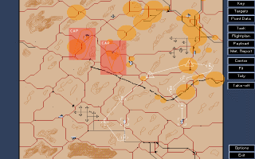](SCRSHOTS/15.PNG?raw=true "15")
[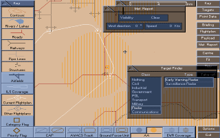](SCRSHOTS/16.PNG?raw=true "16")
[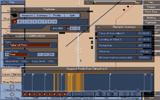](SCRSHOTS/17.PNG?raw=true "17")
[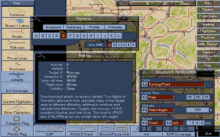](SCRSHOTS/18.PNG?raw=true "18")
[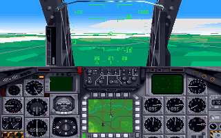](SCRSHOTS/19.PNG?raw=true "19")
[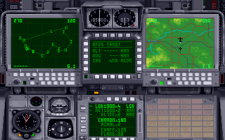](SCRSHOTS/20.PNG?raw=true "20")
[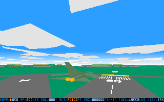](SCRSHOTS/21.PNG?raw=true "21")
[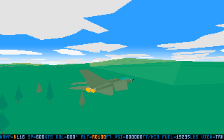](SCRSHOTS/22.PNG?raw=true "22")

## Community

Interested in the project? Feel free to join us via
[Discord](https://discord.gg/MKzBAxe)!

For forum discussions, join us at [Dogs Of War Virtual Unit
forums](http://dogsofwarvu.com/forum/index.php/topic,5046.0.html)!

## Review and download

A review of the game along with a download link can be found here:
[Flying the low-poly
skies](http://www.oldpcgaming.net/tornado-1993-review/).

## Compiling

To compile _Tornado_ under DOS simply enter:
```
SET PATH=\MASM611\BIN
BUILD
```

## New keyboard shortcuts
### Miscellaneous
```
Backslash \ shows the Digital Integration credits (names) screen
Key d toggles damage shake mode on and off
Key 8 toggles Soundblaster Tornado theme music on and off
```

### Split-screen
```
Hit F1 first to show the tracking view.
] cycles forwards to the split-screen, then to other views.
[ cycles backwards through the various views.
3 clears the mini-windows, leaving just the Tracking View view
```

### Night Vision Colours
```
Shift+TAB toggles the green night colors on and off.
```

### Tracking View
```
- Press and hold F1 to adjust the Tornado to a higher perspective
- Press and hold Alt+F1 to adjust the Tornado to a lower perspective
- Press 1 to shift the horizon down so that more sky is seen
- Press 0 to shift the horizon up so that more ground is seen
- Press 2 to shift the view point right-wards, perspective of vehicle
  shifts leftwards
- Press 9 to shift the view point right-wards, perspective of vehicle
  shifts leftwards
```

### Drone View
```
- Press 1 to shift the horizon up so that more ground is seen; drone
  perspective will shift up
- Press 0 to shift the horizon down so that more sky is seen; drone
  perspective will shift down
- Press 2 to shift the view point right-wards, perspective of drone shifts
  leftwards
- Press 9 to shift the view point right-wards, perspective of drone shifts
  leftwards
```

### Other External Views
```
- 3 shows the EScope Terrain Following Radar profile at the bottom right
- of the screen. This happens whenever the bottom status bar is shown
- F2 shows the rear, "Check Six!" view
- F2 pressed a second time will show a lower "Check Six!" view
- F3 gives a flyby view
- Alt+P toggles between a freely pitching horizon and a fixed horizontal
  horizon
```

### Full-screen HUD and TV-Tab views
```
- Shift+D in Pilot cockpit view (Home), will toggle between full-screen
  pilot HUD and the Pilot's cockpit
- Shift+PgUp when in full-screen TV-Tab view (FLIR or TIALD) will bring
  the gamer back into the Navigator's Cockpit
- Shift+D will activate the full-screen FLIR and TIALD views when in the
  Navigator cockpit view (PgUp)
```

### ZRK-Romb (Gecko) and ZSU-23-4 (Shilka) views
```
- Press F11 to show the ZRK-Romb-to-Tornado tracking view. Non-rotatable
- Press F12 to show the ZSU-23-4-to-Tornado tracking view. Non-rotatable
- Combo press Shift+Ctrl or Ctrl+Alt to activate the rotatable
  individual vehicle view, which must be followed up with Alt+Shift to
  display a ZRK-Romb or ZSU-23-4 that has probably already locked onto
  your Tornado
- Press and hold Shift+Ctrl see the vehicle from a higher angle
  (e.g. imagine being higher than the vehicle, looking downwards)
- Press and hold Ctrl+Alt see the vehicle from a lower angle
  (e.g. imagine lying on the grass and you are looking up towards)
- Press 1 to shift the horizon down so that more sky is seen
- Press 0 to shift the horizon up so that more ground is seen
- Press 2 to shift the view point right-wards, perspective of vehicle
  shifts leftwards
- Press 9 to shift the view point right-wards, perspective of vehicle
  shifts leftwards
- Alt+Shift to toggle between a ZRK-Romb (Gecko) and ZSU-23-4 (Shilka)
  view
```

## Command-line parameters
For example, if you use the below command line parameters of `/pm` and
`/e1`, this means your Tornado will start with Pilot MFD failure and one
engine is K.O.'ed.  `FLIGHT /pm /e1`

```
/ab  airbrakes
/ad  ADC (autopilot)
/e1  engine 1
/e2  engine 2
/ec  ECM
/fl  flaps
/gr  gear
/hd  HUD
/n1  night 1 (dusk)
/n2  night 2
/n3  night 3
/n4  night 4 (midnight)
/nc  no collisions
/nm  navigator MFD
/o   overcast
/p   object preview mode
/pa  auto-run object preview mode
/pm  pilot MFD
/qs  quick start ("/qs" is same as "/a /if /ig /iw /nc /w")
/rd  ground/air radar
/rt  radar test TAB display enabled (debugging)
/rw  RWR
/sa  AdLib sound effects
/sb  SoundBlaster sound effects
/sn  no sound effects
/sp  SPILS
/sr  Roland LAPC1 sound effects
/ss  internal speaker sound effects
/sw  wing sweep
/t1  two player mode (com1:), 9600 Baud
/t2  two player mode (com2:), 9600 Baud
/tm  ThrustMaster joystick
/to  navigator TAB1
/tr  thrust reversers
/tt  navigator TAB2
/va  ADV variant
/ve  ECR variant
/vi  IDS variant
/w   set fixed weight (range = /w33000 .. /w60000 lbs)
/xw  cross winds enabled (range = /xw5 .. /xw75 kts)
```
